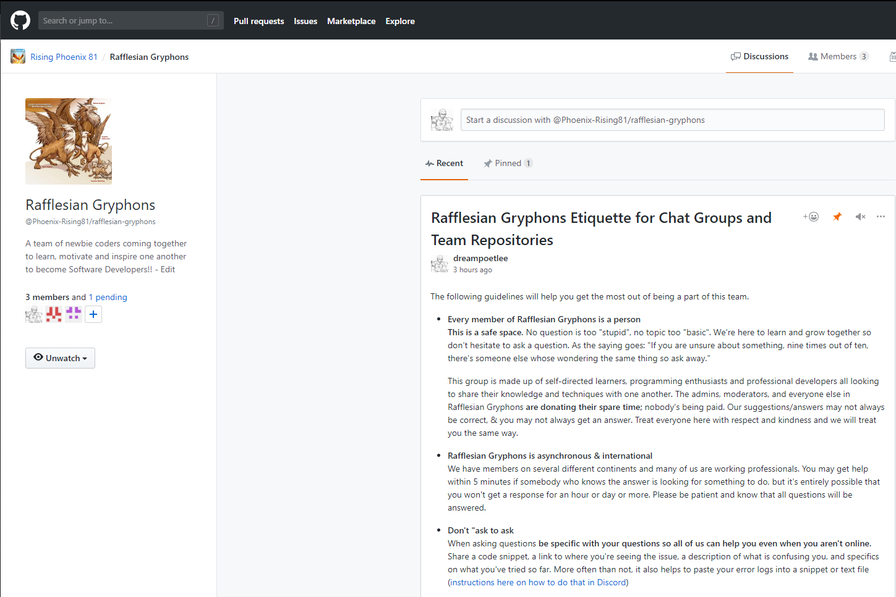

# Daily Log of Round 1 of My 100 Days of Code Journal
## R1Day1: 1 Nov 18, Thursday

  

Today I took my first step down the road to becoming a Node.js Developer even though I didn't really do any actual coding. Instead of sitting down and trying to code like a mad kitty I decided to come up with a plan of attack for this journey. So I created a new GitHub repo called Zero to Mastery. After creating the repo I worked on the Readme.md file and established a "Learn-to-Code" Curriculum which included a six-week plan of attack.

  

Before the day ended I did find the time to review the first section of the Zero to Mastery course which was mainly an overview of the course and community that's been built.  Speaking of the community I had no idea how popular I would be. I posted a message in the programming-buddies channel basically saying that I'm new to the course and was looking for a programming wingman to travel down this path of learning with me. I wasn't really expecting to get a response from anyone, but within eight hours I didn't just get one wingman but three. After the second potential wingman hit me up I decided that it would be awesome if we all formed a small coding group to help us ease on down the road.

Saying that out loud makes me feel like Dorothy from THE WIZ (the best version of the Wizard of OZ)!!!

  

## R1Day2: 2 Nov 18, Friday
So today I didn't spend any time doing any actual coding, however, I was still busy coding because I spent most of my time coding my Day 1 experience. It sucks that I'm behind on my days but I'm not so far behind that I can't catch up. I have to say that it's good that I'm doing this challenge because every day I'm coding something regardless if I've fallen behind on learning something new or not. However, I don't want to get to far behind since I'm the lead developer for my coding group.

  

## R1Day3: 3 Nov 18, Saturday
I'm really happy to say that today was a very productive day for me. I finished the following sections in my Zero to Mastery course:

  
  

Doing two sections in one day might not seem like much but believe me it's a big deal for someone like me who loves to procrastinate and who have the attention span of a:

  

So for me to find the focus to sit down and knock out those two sections in one sitting is awesome.

Even though I managed to complete these two setions in one day, it's not the biggest thing that I did today. I'm really excited that I created my first Github organization page called **Rising Phoenix 81**.

  

Then I created my first team page for my coding buddies and myself to showcase the team projects that we're going to create.

  

## R1Day4: 4 Nov 18, Sunday
Today I didn't wear my coder hat till it was almost time for me to go to bed. Instead I decided to put on the hat of a team leader and give my new coding buddies a small challenge in using Git and GitHub. I asked them to do the following:

  

Once everyone had a chance to work on the assignment I went back to review everyone's GitHub repos and offer any feedback to help them improve them.

  

I have to admit that it was kind of fun to put on the team leader hat and it was really nice to see that my feedback was well received by my teammates. I'm really happy to be working with a great bunch of gryphons who are excited and dedicated to becoming a software developer like me. Speaking of becoming a software developer I did manage to do a little bit of code review before calling it quits for the day. I started to review the second part of the Lambda School precourse work for the upcoming online bootcamp session. Which reminds me that I have to finish it all, plus the interview before 19 Nov 18. Talk about pressure, but it's not like this 

  

 can't handle the pressure!!!

## R1Day5: 5 Nov 18, Monday
Fifth day into this 100 day challenge and I'm still easing down the road with my coding buddies. While my team worked on creating their GitHub repos for the 100 Days of Code challenge, I deceided to tackle the second portion of the Lambda School precourse work. This time we reviewed HTML and CSS fundamentals.

  

After crusing through the review I completed tow of the projects for the lesson.

  
  

Six more sections to do before I can sit down for my interview with Lambda School and do the code challenge.

## R1Day6: 6 Nov 18, Tuesday
Well have to say that things didn't go so well for me today. I got distracted by the 2018 Midterm Elections and all of the news cast surrounding all of that. Even though I was distracted I was able to work on the first half of the third exercise for lesson 2 of the precourse work.

  

## R1Day7: 7 Nov 18, Wednesday
Seven days down and thus marks the end of my first week. Unfortunately, I didn't end the week as strong as I would have liked. I was tired and depressed by the results of the 2018 Midterm Elections so I didn't have the energy to code a lot. I barely had enough energy to finish the second half of the third exercise from lesson 2. Oh well, it is what it is and tomorrow is a brand new day.

  

## R1Day8: 8 Nov 18, Thursday
At this moment in time I haven't sat down and done any new coding because I was still a little tired and distracted. So I'm going to use today as a day of reflection and look back at the things that I've done for the week. This week I took the first step towards becoming a Software Developer by creating a game plan and coming up with some goals that I wanted to accomplish within the next few months.

After creating the game plan I started with the Zero to Mastery course where I started a coding group and took on the role of team lead. I have to admit that taking on this new role was totally unexpected because I had originally planned on just doing the course all by myself, but I'm glad that I'm not. At the same time, I decided to complete Lambda School precourse work for the upcoming online bootcamp session. So far I've completed two out of the eight sections of the precourse work.

Overall, I have to say that the past seven days have been very good and productive even though I was a little distracted the past two days. Before I close this day out I wanted to take a moment to share a glimpse at the amount of time that I've spent coding this week. I've been using the WakaTime app which is committed to making time tracking fully automatic for every programmer.

  

## R1Day9: 9 Nov 18, Friday
**YIPPIE!!!** I've reached the ninth day of my challenge and despite a few minor distractions I haven't given up. Better yet I've moved on to learning new stuff, well not exactly. I completed the Section 4 of the ZTM course which basically was an introduction of HTML 5. Since I've practically been trying to become a Software Developer off and on for the past two years I pretty much already knew about HTML 5. So today was basically a refresher course of HTML 5 which discussed the basic tags and elements of HTML.

  

## R1Day10: 10 Nov 18, Saturday

  

When I went to bed this morning around 1:45am, I thought that I would get a good nights rest so that I could wake up later in the day and finish reviewing Section 5 of the ZTM course that I started on before I finally gave into the sandman's spell. However, when I woke up a few hours later around noon, my body and mind had other desires. I got out of bed, walked to the living room and plopped into my gaming chair and never got up. I grabbed my PS4 controller and played video games all day and night. If it wasn't for me treating this challenge like a daily journal I probably wouldn't be coding right now. Oh well, like I told one of my teammates when he mentioned that our group was awfully quite today, We all need a day of rest once in awhile and I guess today was mine.

## R1Day11: 11 Nov 18, Sunday

  

Now that my lazy day has come and gone I've decided that the best way to get back into the swing of things would be to review the next module of the precourse work from Lambda School. So today I took my first inital look at JavaScript and to be honest I felt a little bit intimidated. In the past when I would try to learn how to code, I would learn everything about HTML & CSS, but never anything past that point. It seemed like everytime I got close to learning more I kept hitting a brick wall and I couldn't get over it. However, this time around I'm going to meet that brick wall head on and knock it down!!!

## R1Day12: 12 Nov 18, Monday

  

Today I really felt like a real big imopostor when I tried to complete the code review for the Introduciton to JavaScript module. The review had at least ten basic exercise questions that I needed to answer, however, on my first attempt I barely answered three of the questions. I had no clue how to answer the other seven questions and when I tried to Google them I wasn't able to find any answers because I really didn't know what questions to look up. I stared at my computers for hours with a very dumbfound look on my face because I really didn't know what to do or how to begin. When hour number five rolled around I finally just turned my computer off and watched tv. I have to keep telling myself that tomorrow is a brand new day and another chance to try it again.

## R1Day13: 13 Nov 18, Tuesday
I'm still suffering from the Impostor Syndrome, but I decided not to dwell to much on it. Instead, I received some very good advice on how I could make my journal more readable for those who aren't very computer savy as the average computer programmer.

  

They basically said that should write all of my logs using the Markdown syntax instead of HTML so that everyone can review my daily progress if they wanted to. So I spent all day moving all of my previous logs from HTML to Markdown and I have to say I really like how it looks. Especially since I haven't learned how to host my log on an actual website as of yet. 

## R1Day14: 14 Nov 18, Wednesday

  

So two days ago I made my very first attempt to learn JavaScript and I had assumed that I would be able to breeze thru it just like I did while learning HTML & CSS. Boy was I dead wrong. For the very first I came face to face with the dreaded monster from the deep, known to many programmers and developers as the "Impostor Syndrome".

  

Like every newbie developer/programmer out there I knew that this horrendous, mechanical monster was out there lurking in the shadows waiting for the right moment to strike terror and fear into those unexpected victims that crossed it path. However, for some strange reason I thought that I would be immune to it's diabolical ways. Unfortunately, when it finally found me, while I was making my first attempt at learning JavaScript, I just froze like a dear caught in the headlights of car. For two days straight, I just stood there frozen in time waiting for a swift and painless death.

As the seconds slowly ticked by I began to think back to my previous coding attempts and the fact that I kept running away when things got hard. The idea of running away and quiting again started to look very pleasing to me. Just as I was on the verge of throwing in the towel, the image of my coding team's logo flashed before my eyes.

  

I started thinking about how this group of newbie coders where just as dedicated and motivated as I am to learn how to code and become a Software Developer. At some point along their personal coding journey their going to run into the "Impostor Syndrome" monster and how can I encourage them to keep going if I turn tail and run away now. At that very moment all my fears melted away and I decided that I wasn't going to give up on my team nor on myself. I'm going to conquor the "Impostor Syndrome" monster along with my fears because everything that I want is waiting for me on the other side!!! **NOTHING AND I MEAN NOTHING IS GOING TO GET IN MY WAY!!!** 

To the Rafflesian Gryophons: @brendons13, @emmanueltweneboah, @zero2hero2018, @sahanashenoy...thank you for walking down this journey with me and I'm very grateful to know that I'm not in this alone. Let's keep working together to reach our goals of becoming **SOFTWARE DEVELOPERS**!

## R1Day15: 15 Nov 18, Thursday
So today I decided to get back into the coding game after facing down the dreaded "Impostor Syndrome" monster. However, I wasn't quite ready to put on the hat of a developer so I put on the hat of a team leader instead. As the team leader I created and updated the team repo [Rafflesian Gryphons Life Cycle](https://github.com/Phoenix-Rising81/gryphon_life_cycle) by creating the readme etiquette files. I can't wait till we start working on our projects. 

Despite the fact that I came faced to face with "Impostor Syndrome" monster, I'd say my week was very productive. However, the biggest lesson that I learned this week is that you should never let fear stop you from doing what you want to do. So before I close this day out, here's a snap shot at the time I spent coding this week via WakaTime.

  

## R1Day16: 16 Nov 18, Friday
After some careful consideration I've decided that the best way for me to truly defeat the "Impostor Syndrome" monster is for me to go back and review the basics again. This way, I can ensure that I have a complete grasp on what I'm learning and to help my code buddies with anything that they may need. The best way for me to get back to the basics was for me go back to the Zero to Mastery course and complete the remaing sections. So today, I completed Section 5 which covered HTML Forms, tags and a few HTML challenges.

  

Once I completed the section I decieded to test my knowledge by taking the HTML quiz on [W3Schools](https://www.w3schools.com/html/html_quiz.asp). Surprisingly enough I did very well on the quiz without having to look up any of the answeres.

  

## R1Day 17: 17 Nov 18, Saturday
I can't say that today was a very busy day of coding for me. All I managed to do today was to review the mini parts of section 6 of the ZTM course. 

  

Some how my code wasn't broke when I tried to add a background image to the CSS code that we were using in the course. I knew that there was a very simple solution to the problem, but for the life of me I couldn't figure out what it was. I spent hours researching it online and trying different ways to input the background image, but it just wasn't working. I eventually got so frustrated that I just shut off my computer for a while. Later I decided to take another crack at it when I finally realized that forgot to include the folder where the background image was located in my code. 

  

As soon as I did that simple fix the background image appeared and I felt like a really big denounce. Oh well, I guess it's true when they say that it's best to walk away from a problem for a while and then look back at it with fresh eyes.