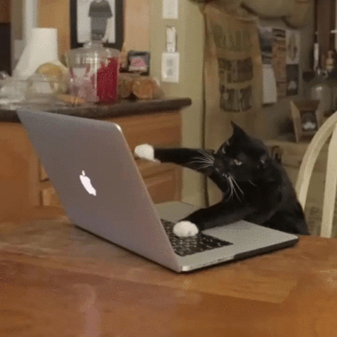

# Daily Log of Round 1 of My 100 Days of Code Journal
## R1Day1: 1 Nov 18, Thursday

  

Today I took my first step down the road to becoming a Node.js Developer even though I didn't really do any actual coding. Instead of sitting down and trying to code like a mad kitty I decided to come up with a plan of attack for this journey. So I created a new GitHub repo called Zero to Mastery. After creating the repo I worked on the Readme.md file and established a "Learn-to-Code" Curriculum which included a six-week plan of attack.

  

Before the day ended I did find the time to review the first section of the Zero to Mastery course which was mainly an overview of the course and community that's been built.  Speaking of the community I had no idea how popular I would be. I posted a message in the programming-buddies channel basically saying that I'm new to the course and was looking for a programming wingman to travel down this path of learning with me. I wasn't really expecting to get a response from anyone, but within eight hours I didn't just get one wingman but three. After the second potential wingman hit me up I decided that it would be awesome if we all formed a small coding group to help us ease on down the road.

Saying that out loud makes me feel like Dorothy from THE WIZ (the best version of the Wizard of OZ)!!!

  

## R1Day2: 2 Nov 18, Friday
So today I didn't spend any time doing any actual coding, however, I was still busy coding because I spent most of my time coding my Day 1 experience. It sucks that I'm behind on my days but I'm not so far behind that I can't catch up. I have to say that it's good that I'm doing this challenge because every day I'm coding something regardless if I've fallen behind on learning something new or not. However, I don't want to get to far behind since I'm the lead developer for my coding group.

  

## R1Day3: 3 Nov 18, Saturday
I'm really happy to say that today was a very productive day for me. I finished the following sections in my Zero to Mastery course:

  
  

Doing two sections in one day might not seem like much but believe me it's a big deal for someone like me who loves to procrastinate and who have the attention span of a:

  

So for me to find the focus to sit down and knock out those two sections in one sitting is awesome.

Even though I managed to complete these two setions in one day, it's not the biggest thing that I did today. I'm really excited that I created my first Github organization page called **Rising Phoenix 81**.

  

Then I created my first team page for my coding buddies and myself to showcase the team projects that we're going to create.

  

## R1Day4: 4 Nov 18, Sunday
Today I didn't wear my coder hat till it was almost time for me to go to bed. Instead I decided to put on the hat of a team leader and give my new coding buddies a small challenge in using Git and GitHub. I asked them to do the following:

  

Once everyone had a chance to work on the assignment I went back to review everyone's GitHub repos and offer any feedback to help them improve them.

  

I have to admit that it was kind of fun to put on the team leader hat and it was really nice to see that my feedback was well received by my teammates. I'm really happy to be working with a great bunch of gryphons who are excited and dedicated to becoming a software developer like me. Speaking of becoming a software developer I did manage to do a little bit of code review before calling it quits for the day. I started to review the second part of the Lambda School precourse work for the upcoming online bootcamp session. Which reminds me that I have to finish it all, plus the interview before 19 Nov 18. Talk about pressure, but it's not like this 

  

 can't handle the pressure!!!

  