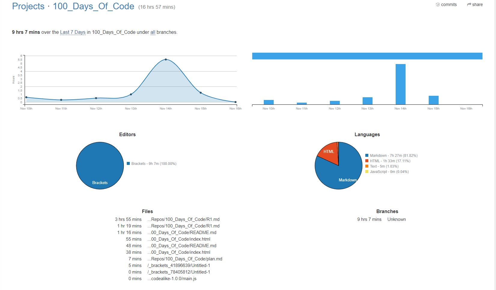
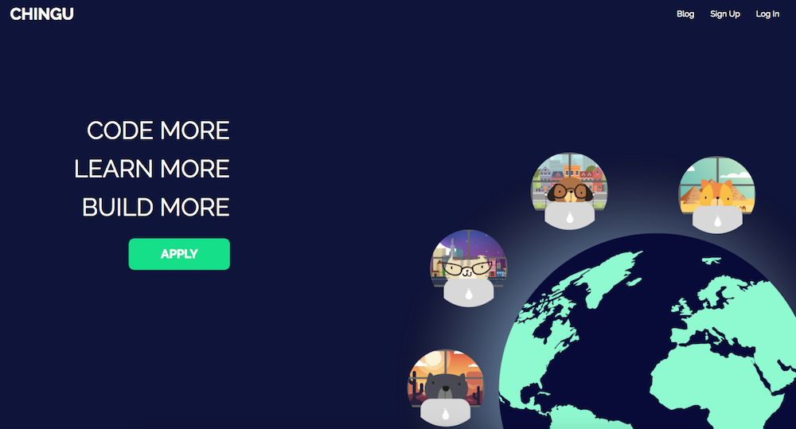

# Daily Log of Round 1 of My 100 Days of Code Journal
## R1Day1: 1 Nov 18, Thursday

  

Today I took my first step down the road to becoming a Node.js Developer even though I didn't really do any actual coding. Instead of sitting down and trying to code like a mad kitty I decided to come up with a plan of attack for this journey. So I created a new GitHub repo called Zero to Mastery. After creating the repo I worked on the Readme.md file and established a "Learn-to-Code" Curriculum which included a six-week plan of attack.

  

Before the day ended I did find the time to review the first section of the Zero to Mastery course which was mainly an overview of the course and community that's been built.  Speaking of the community I had no idea how popular I would be. I posted a message in the programming-buddies channel basically saying that I'm new to the course and was looking for a programming wingman to travel down this path of learning with me. I wasn't really expecting to get a response from anyone, but within eight hours I didn't just get one wingman but three. After the second potential wingman hit me up I decided that it would be awesome if we all formed a small coding group to help us ease on down the road.

Saying that out loud makes me feel like Dorothy from THE WIZ (the best version of the Wizard of OZ)!!!

  

## R1Day2: 2 Nov 18, Friday

So today I didn't spend any time doing any actual coding, however, I was still busy coding because I spent most of my time coding my Day 1 experience. It sucks that I'm behind on my days but I'm not so far behind that I can't catch up. I have to say that it's good that I'm doing this challenge because every day I'm coding something regardless if I've fallen behind on learning something new or not. However, I don't want to get to far behind since I'm the lead developer for my coding group.

  

## R1Day3: 3 Nov 18, Saturday

I'm really happy to say that today was a very productive day for me. I finished the following sections in my Zero to Mastery course:

  
  

Doing two sections in one day might not seem like much but believe me it's a big deal for someone like me who loves to procrastinate and who have the attention span of a:

  

So for me to find the focus to sit down and knock out those two sections in one sitting is awesome.

Even though I managed to complete these two setions in one day, it's not the biggest thing that I did today. I'm really excited that I created my first Github organization page called **Rising Phoenix 81**.

  

Then I created my first team page for my coding buddies and myself to showcase the team projects that we're going to create.

  

## R1Day4: 4 Nov 18, Sunday

Today I didn't wear my coder hat till it was almost time for me to go to bed. Instead I decided to put on the hat of a team leader and give my new coding buddies a small challenge in using Git and GitHub. I asked them to do the following:

  

Once everyone had a chance to work on the assignment I went back to review everyone's GitHub repos and offer any feedback to help them improve them.

  

I have to admit that it was kind of fun to put on the team leader hat and it was really nice to see that my feedback was well received by my teammates. I'm really happy to be working with a great bunch of gryphons who are excited and dedicated to becoming a software developer like me. Speaking of becoming a software developer I did manage to do a little bit of code review before calling it quits for the day. I started to review the second part of the Lambda School precourse work for the upcoming online bootcamp session. Which reminds me that I have to finish it all, plus the interview before 19 Nov 18. Talk about pressure, but it's not like this 

  

 can't handle the pressure!!!

## R1Day5: 5 Nov 18, Monday

Fifth day into this 100 day challenge and I'm still easing down the road with my coding buddies. While my team worked on creating their GitHub repos for the 100 Days of Code challenge, I deceided to tackle the second portion of the Lambda School precourse work. This time we reviewed HTML and CSS fundamentals.

  

After crusing through the review I completed tow of the projects for the lesson.

  
  

Six more sections to do before I can sit down for my interview with Lambda School and do the code challenge.

## R1Day6: 6 Nov 18, Tuesday

Well have to say that things didn't go so well for me today. I got distracted by the 2018 Midterm Elections and all of the news cast surrounding all of that. Even though I was distracted I was able to work on the first half of the third exercise for lesson 2 of the precourse work.

  

## R1Day7: 7 Nov 18, Wednesday

Seven days down and thus marks the end of my first week. Unfortunately, I didn't end the week as strong as I would have liked. I was tired and depressed by the results of the 2018 Midterm Elections so I didn't have the energy to code a lot. I barely had enough energy to finish the second half of the third exercise from lesson 2. Oh well, it is what it is and tomorrow is a brand new day.

  

## R1Day8: 8 Nov 18, Thursday

At this moment in time I haven't sat down and done any new coding because I was still a little tired and distracted. So I'm going to use today as a day of reflection and look back at the things that I've done for the week. This week I took the first step towards becoming a Software Developer by creating a game plan and coming up with some goals that I wanted to accomplish within the next few months.

After creating the game plan I started with the Zero to Mastery course where I started a coding group and took on the role of team lead. I have to admit that taking on this new role was totally unexpected because I had originally planned on just doing the course all by myself, but I'm glad that I'm not. At the same time, I decided to complete Lambda School precourse work for the upcoming online bootcamp session. So far I've completed two out of the eight sections of the precourse work.

Overall, I have to say that the past seven days have been very good and productive even though I was a little distracted the past two days. Before I close this day out I wanted to take a moment to share a glimpse at the amount of time that I've spent coding this week. I've been using the WakaTime app which is committed to making time tracking fully automatic for every programmer.

  

## R1Day9: 9 Nov 18, Friday

**YIPPIE!!!** I've reached the ninth day of my challenge and despite a few minor distractions I haven't given up. Better yet I've moved on to learning new stuff, well not exactly. I completed the Section 4 of the ZTM course which basically was an introduction of HTML 5. Since I've practically been trying to become a Software Developer off and on for the past two years I pretty much already knew about HTML 5. So today was basically a refresher course of HTML 5 which discussed the basic tags and elements of HTML.

  

## R1Day10: 10 Nov 18, Saturday

  

When I went to bed this morning around 1:45am, I thought that I would get a good nights rest so that I could wake up later in the day and finish reviewing Section 5 of the ZTM course that I started on before I finally gave into the sandman's spell. However, when I woke up a few hours later around noon, my body and mind had other desires. I got out of bed, walked to the living room and plopped into my gaming chair and never got up. I grabbed my PS4 controller and played video games all day and night. If it wasn't for me treating this challenge like a daily journal I probably wouldn't be coding right now. Oh well, like I told one of my teammates when he mentioned that our group was awfully quite today, We all need a day of rest once in awhile and I guess today was mine.

## R1Day11: 11 Nov 18, Sunday

  

Now that my lazy day has come and gone I've decided that the best way to get back into the swing of things would be to review the next module of the precourse work from Lambda School. So today I took my first inital look at JavaScript and to be honest I felt a little bit intimidated. In the past when I would try to learn how to code, I would learn everything about HTML & CSS, but never anything past that point. It seemed like everytime I got close to learning more I kept hitting a brick wall and I couldn't get over it. However, this time around I'm going to meet that brick wall head on and knock it down!!!

## R1Day12: 12 Nov 18, Monday

  

Today I really felt like a real big imopostor when I tried to complete the code review for the Introduciton to JavaScript module. The review had at least ten basic exercise questions that I needed to answer, however, on my first attempt I barely answered three of the questions. I had no clue how to answer the other seven questions and when I tried to Google them I wasn't able to find any answers because I really didn't know what questions to look up. I stared at my computers for hours with a very dumbfound look on my face because I really didn't know what to do or how to begin. When hour number five rolled around I finally just turned my computer off and watched tv. I have to keep telling myself that tomorrow is a brand new day and another chance to try it again.

## R1Day13: 13 Nov 18, Tuesday

I'm still suffering from the Impostor Syndrome, but I decided not to dwell to much on it. Instead, I received some very good advice on how I could make my journal more readable for those who aren't very computer savy as the average computer programmer.

  

They basically said that should write all of my logs using the Markdown syntax instead of HTML so that everyone can review my daily progress if they wanted to. So I spent all day moving all of my previous logs from HTML to Markdown and I have to say I really like how it looks. Especially since I haven't learned how to host my log on an actual website as of yet. 

## R1Day14: 14 Nov 18, Wednesday

  

So two days ago I made my very first attempt to learn JavaScript and I had assumed that I would be able to breeze thru it just like I did while learning HTML & CSS. Boy was I dead wrong. For the very first I came face to face with the dreaded monster from the deep, known to many programmers and developers as the "Impostor Syndrome".

  

Like every newbie developer/programmer out there I knew that this horrendous, mechanical monster was out there lurking in the shadows waiting for the right moment to strike terror and fear into those unexpected victims that crossed it path. However, for some strange reason I thought that I would be immune to it's diabolical ways. Unfortunately, when it finally found me, while I was making my first attempt at learning JavaScript, I just froze like a dear caught in the headlights of car. For two days straight, I just stood there frozen in time waiting for a swift and painless death.

As the seconds slowly ticked by I began to think back to my previous coding attempts and the fact that I kept running away when things got hard. The idea of running away and quiting again started to look very pleasing to me. Just as I was on the verge of throwing in the towel, the image of my coding team's logo flashed before my eyes.

  

I started thinking about how this group of newbie coders where just as dedicated and motivated as I am to learn how to code and become a Software Developer. At some point along their personal coding journey their going to run into the "Impostor Syndrome" monster and how can I encourage them to keep going if I turn tail and run away now. At that very moment all my fears melted away and I decided that I wasn't going to give up on my team nor on myself. I'm going to conquor the "Impostor Syndrome" monster along with my fears because everything that I want is waiting for me on the other side!!!

**NOTHING AND I MEAN NOTHING IS GOING TO GET IN MY WAY!!!** 

To the Rafflesian Gryophons: @brendons13, @emmanueltweneboah, @zero2hero2018, @sahanashenoy...thank you for walking down this journey with me and I'm very grateful to know that I'm not in this alone. Let's keep working together to reach our goals of becoming **SOFTWARE DEVELOPERS**!

## R1Day15: 15 Nov 18, Thursday

So today I decided to get back into the coding game after facing down the dreaded "Impostor Syndrome" monster. However, I wasn't quite ready to put on the hat of a developer so I put on the hat of a team leader instead. As the team leader I created and updated the team repo [Rafflesian Gryphons Life Cycle](https://github.com/Phoenix-Rising81/gryphon_life_cycle) by creating the readme etiquette files. I can't wait till we start working on our projects. 

Despite the fact that I came faced to face with "Impostor Syndrome" monster, I'd say my week was very productive. However, the biggest lesson that I learned this week is that you should never let fear stop you from doing what you want to do. So before I close this day out, here's a snap shot at the time I spent coding this week via WakaTime.

  

## R1Day16: 16 Nov 18, Friday

After some careful consideration I've decided that the best way for me to truly defeat the "Impostor Syndrome" monster is for me to go back and review the basics again. This way, I can ensure that I have a complete grasp on what I'm learning and to help my code buddies with anything that they may need. The best way for me to get back to the basics was for me go back to the Zero to Mastery course and complete the remaing sections. So today, I completed Section 5 which covered HTML Forms, tags and a few HTML challenges.

  

Once I completed the section I decieded to test my knowledge by taking the HTML quiz on [W3Schools](https://www.w3schools.com/html/html_quiz.asp). Surprisingly enough I did very well on the quiz without having to look up any of the answeres.

  

## R1Day17: 17 Nov 18, Saturday

I can't say that today was a very busy day of coding for me. All I managed to do today was to review the mini parts of section 6 of the ZTM course. 

  

Some how my code wasn't working when I tried to add a background image to the CSS code that we were using in the course. I knew that there was a very simple solution to the problem, but for the life of me I couldn't figure out what it was. I spent hours researching it online and trying different ways to input the background image, but it just wasn't working. I eventually got so frustrated that I just shut off my computer for a while. Later I decided to take another crack at it when I finally realized that forgot to include the folder where the background image was located in my code. 

  

As soon as I did that simple fix the background image appeared and I felt like a really big denounce. Oh well, I guess it's true when they say that it's best to walk away from a problem for a while and then look back at it with fresh eyes.

## R1Day18: 18 Nov 18, Sunday

  

Really hate to say this but today was a "Lazy Sunday" for me. I sat on the couch all day watching tv, then I went to the movies with friends to see *Fantastic Beasts: The Crimes of Grindelwald*. Once again I have to say that I'm very gratefull for turing this challenge into more of journal thing otherwise I wouldn't be coding at all. Oh well it's timme to hit the hay.

  

## R1Day19: 19 Nov 18, Monday

Today wasn't really a very productive day of coding but I did manage to a lot of work done though. So my other remote dev team that was created for the new Chingu-Voyage 7 finally got together for our first team meeting and we decided on the direction we're going to take our project in.  After the meeting I decided to work on the team GitHub repo readme file. I forgot to mention that the team is made up of two other experienced developers and they nominated me to be the team lead.

  

## R1Day20: 20 Nov 18, Tuesday

Today was another day of non coding but still a very productive one never the less. My Toucans-Team 6 (who are a part of the Chingu Voyage 7) was able to have a quick team meeting despite being tied up with the upcoming holiday. In the meeting we finalzed the team project that we're going to build during this voyage and some of the stacks that we wanted to use. I have to say that I'm really proud of this team and the things that they want to accomplish. I know it's going to be a big undertaking with a lot of work, but it's gonna be fun and worthwhile in the end.

  

## R1Day21: 21 Nov 18, Wednesday

Well doing all of this team building stuff is great but if I'm going to be any use to any of my teams I need to get back to my studying. For example, on of my team mates wants to incorporate Vanilla JavaScript into our project which is something I'm totally clueless about. To ensure that I'm able to pull my weight I went back to the ZTM course and completed the section 6 portion.

  

After I finished the section I decided to take a crake at the [CSS Quiz](https://www.w3schools.com/css/css_quiz.asp) on [w3schools](https://www.w3schools.com/). Though I had to take the quiz two times before getting a decent score.

  
  

It's really a good thing that I'm going back and reviewing all of this again.

## R1Day22: 22 Nov 18, Thursday

### HAPPY THANKSGIVING EVERYONE!!!

  

Like many people today I didn't do any coding because I was otherwise pre occupied by all the food that I was busy stuffing into my face. Now that I have finished stuffing my face I'm going to sit down on this couch and close my eyes. Boy I feel the Sandman approching!!!

  

## R1Day23: 23 Nov 18, Friday

### BLACK FRIDAY!!! BLACK FRIDAY!!! BLACK FRIDAY!!!!

So while most of Americans where losing their minds at various retail stores chasing the biggest deals that they could find.

  

I decided to stay home and develop my coding skills more while looking for a new line of employment as well. However, before I go into all that I managed to learn today, let me quickly recap everything that I did for the week.

My thrid week of coding was the busiest week so far in my **#100DaysofCoding** Challenge so far but I can imagine that it's only going to get busier as I keep doing the challenge. This week I wrote code for three differnt projects, contributed to two differnt code groups and continuned my training in the ZTM course.

  
  
  

I have to say that I'm really happy with the work that I've done so far.

## R1Day24: 24 Nov 18, Saturday

Yesterday and today I spent all of my coding time working on Section 7 of the ZTM course which covered a few advance CSS topics. My biggest take away from this section was how to use Flexbox in CSS and how to make images responsive. 

  
  

## R1Day25: 25 Nov 18, Sunday

  

Today has been a very lazy day for me. All I did today was sit at home with my eyes glued to the tv. Don't know how many times I'm gonna say this, but I'm glad that I made this code challenge my own by turning it into a daily code journal. If I didn't then I wouldn't be coding at all.

## R1Day26: 26 Nov 18, Monday

I have to say that this day was probably one of the worst days I've had during this code challenge and it had nothing to do with me doing any coding at all. What seemed like a good start to my day quickly turned bad when my only mode of transportation around town turned out looking like this by the end of the day.

  

So I spent most of my day trying to figure out a way to replace my broken down scooter so that I could get back on the road. Luckily for me the day ended with me finally getting back on the road. Hopefully tomorrow my day will go better and I can get back to doing some actual coding.

## R1Day27: 27 Nov 18, Tuesday

I really, truely wanted to sit down tonight and say that I spent all day finally doing some coding or at least reviewing a new section of the ZTM course. Unfortunately, that isn't the case tonight because I didn't do any of those things today. Instead, I spent all day and night job searching.

  

You see a couple of months ago I had this grand plan that I was going to join a coding bootcamp in my area and was under the impression that all of the training would be completed by now. I also assumed that the moment my training was over I would find my first development job within a few weeks of completing the bootcamp. So I decided to inform my employer of my grand plan and that I would be leaving the company around the first of December. Well as my luck would have it, things didn't go as planned and I didn't start the code bootcamp that I was hoping to join. To be completely honest, my grand plan failed so badly that I completely gave up on the whole idea of becoming a Software Developer. (Well that was the case until the beginning of the month that is.) 

Anyway, while I was frozen in place by my fear of failure and lack of confidence in myself the world kept on moving on around me and before I knew it the first of December was staring me in the face. For some silly reason I had assumed that my boss had forgoten all about my upcoming exit because it totally slipped my mind. Sadly for me, my boss hadn't forgotten about my pending exit which he wistfully reminded me two weeks ago. Subsequently, I have been spending the past two weeks on a frenzied job search looking for anything to replace the job that I'm about to lose.

## R1Day28: 28 Nov 18, Wednesday

### GREAT NEWS!! GREAT NEWS!!

  

### YES I GOT A JOB OFFER!!!!

All of that frantic job searching that I've been doing for the past two weeks finally paid off. I had an awesome phone interview yesterday for an emergency managment company that was looking for an Administrative Assistant to head up one of their current relief projects in Florida. The project that I'll be working on will last for three years and the company offers some amazing benefits to include medical, dental, vision, 401K & life insurance. My start date won't be till 10 Dec 18, because I have to wait for all of the background stuff to come back which won't be a problem. I'm just so excited to hear the words **You're Hired**!! 

## R1Day29: 29 Nov 18, Thursday

Today I didn't do any new coding either because I heard the words **You're Hired** for the second time in two days!!! As of this afternoon I'm an Armed Custom Protection Security Officer.

  

It's kind of funny to think of myself as an Armed Guard since I haven't carried a weapon since my days in the service but a job is a job and I could always use the extra $$ to finally get ahead on my bills. So instead of sitting down to code, I was busy running all around town filling out paperwork and getting a physical to make sure that I have what it takes to be an Armed Custom Protection Security Officer.

## R1Day30: 30 Nov 18, Friday

Time for a weekly update of what I've been doing. Unfortunately, I didn't do much coding other than my daily journal because I spent most of my time doing a frantic job search. Luckily for me I managed to land two jobs that will be starting soon. During the day I'll be working as an mild mannered Administrative Assistant. While at night I'll be fighting crime as an Armed Security Guard. It's almost like I'm an modern day Batman but with out the billion dollhears and all of the awesome gadgets.

  

Even though I didn't do much coding this week I still have some WakaTime reports to share.

  
  

## R1Day31: 1 Dec 18, Saturday

No coding for me today. Instead I spent all day long in bed then went to an early Christmas party!!

  

## R1Day32: 2 Dec 18, Sunday

  

Had an amazing time last night with all of my friends, but boy am I paying for it today. As you can probably guess, I'm not in any 
conditon to do any form of coding at all today.

## R1Day33: 3 Dec 18, Monday to R1Day65: 4 Jan 19, Friday

  

So due to intensive training for the jobs and some personal issues that came up. I decceided to take a couple of days off from coding. Now that everything has settled back down I'm looking to pick up where I left off in my coding journey. Luckily my day job offers me a lot of down time so I'm gonna be doing most of my coding then. I'm also gonna be coding at night again since I've decedied not to keep the security guard job.

Even though I have a lot of down time at work, I'm not really authorized to download programs like Git or any IDEs to my work computer which really limits the type of traning that I can do on the job. Lucky enough there's always a work around, so while at work I'm gonna work thru freeCodeCamp curriculum. Hopefully, I'll be able to keep this job for the full three years which means, I should defienitely have the time to complete the course work on freeCodeCamp! First day of coding at work and I was able to complete half of the first section. 

  

## R1Day66: 5 Jan 19, Saturday

While at work today, I managed to complete the Introduction to Basic HTML and HTML5 section of the freeCodeCamp Curriculum. It was good to review the basics again after not coding for such a long time. 

  

## R1Day67: 6 Jan 19, Sunday

  

Was sick as a dog today so I didn't do any coding at all. 

## R1Day68: 7 Jan 19, Monday

Despite being a little under the weather still, I managed to start reviewing the bacic CSS section of the freeCodeCamp Curriculum. However, I didn't do any coding when I got home from work. Instead, I took some more cold medicine, crawled into bed and went back to Dreamland.

  

## R1Day69: 8 Jan 19, Tuesday

On this lovely day, I decided to switch things up just a little bit. I added two addtional courses to my current study program. The first new course that I added and started to review was the HTML5 and CSS Fundamentals course which is part of the Microsoft Professional Program for Front-End Web Development track being offered by edX. Even though most of the material being covered in this course is similar to the material on freeCodeCamp.com, I'm doing it because I can get a certified certificate from Mircosoft which I think would look really impressive on a resume.

  

The second course that added was the precourse work from Lambda School. I'm mainly doing this because I really want to take part of their bootcamp this year and push my learning to the next level. So today I covered 50% of the first module "Introduction to Web Development Fundamentals".

  

## R1Day70: 9 Jan 19, Wednesday

Today was a somewhat productive day for me. I managed to update my Github journal entry and completed the first module from Lambda School Precourse work. One module down three more to go before I can take the code challenge and then apply to the the school. 

  

## R1Day71: 10 Jan 19, Thursday

Instead of moving on to the next module from Lambda School Precourse work, I decided to complete some sections on freeCodeCamp.com.

  

## R1Day72: 11 Jan 19, Friday

  

I believe in this case an image speaks a thousand words. For my first official day off from work I didn't do anything at all. 

## R1Day73: 12 Jan 19, Saturday

While at work today, I decided to switch gears once again. This time, I took a break from doing any coding and decided to read a few articles on [Medium](https://medium.com/). The articles that made it onto my reading list for today were:

1. [Is a Coding Bootcamp something for you?](https://medium.freecodecamp.org/is-a-coding-bootcamp-something-for-you-974c3b5bd3b2)
2. [Learn to code in 2019, get hired, and have fun along the way](https://medium.com/zerotomastery/learn-to-code-in-2019-get-hired-and-have-fun-along-the-way-d4197f96be27)
3. [A Gentler Introduction to Programming](https://medium.freecodecamp.org/a-gentler-introduction-to-programming-1f57383a1b2c)
4. [5 Free Object-Oriented Programming Online Courses for Programmers](https://medium.com/swlh/5-free-object-oriented-programming-online-courses-for-programmers-156afd0a3a73)
5. [Rewire your brain to beat procrastination](https://medium.com/taking-note/rewire-your-brain-to-beat-procrastination-30b7d172c9d2)

Sometimes, reading different articles and getting a fresh prespctive on what your learning can be very helpful as well. 

## R1Day74: 13 Jan 19, Sunday

  

Wasn't motivated to do any coding today. Didn't even have enough motivation to climb out of bed to be honest.

## R1Day 75: 14 Jan 19, Monday

  

When I woke up this morning I had a little furry friend sleeping soundly on my chest. I felt that it would have been terribly rude of me to disturb his slumber so I closed my eyes and went back to sleep as well.

## R1Day 76: 15 Jan 19, Tuesday

I finally managed to drag my lazy bones out of bed and get back to work. While at work I completed the Basic CSS section on freeCodeCamp curriculum and learned a few new CSS tricks.  From the review, I learned how to attach a fallback value to a CSS variable and how to improve browser compatibility when using them.

  

## R1Day 77: 16 Jan 19, Wednesday

Due to my recent days of pure laziness, I fell a little behind in my daily posts. So I spent all day catching everything up and making sure I'm up to date on everything.

  

## R1Day 78: 17 Jan 19, Thursday

Today I started a new section of the freeCodeCamp Curriculum called "Introduction to the Applied Visual Design Challenges".  Most of the challenges that I did were review of things that I've learned before. However, the last three challenges were new items for me. It's good to learn new things even when you're reviewing old material. 

  

## R1Day79: 18 Jan 19, Friday

  

Due to the fact that I rather enjoyed my reading list from last week. I've decided to turn every Friday into a day of reading instead of a day of coding. I'm gonna to read a mixture of articles about coding, job hunting, tech, programming, and software developer.  For this week I chose to read the following articles from Medium:

1. [Des MVC still matter and should you use it?](https://medium.com/@cameron.manavian/does-mvc-still-matter-and-should-you-use-it-3e355b4e09b6)
2. [These Work Habits Will Make You a Successful Programmer](https://medium.com/swlh/these-work-habits-will-make-you-a-successful-programmer-73964379014e)
3. [Why You Need to Learn More Programming Languages](https://blog.usejournal.com/why-you-need-to-learn-more-programming-languages-9160d609eac3)
4. [Starting a Career in Web Development](https://blog.envylabs.com/starting-a-career-in-web-development-c03c972195ca)

## R1Day80: 19 Jan 19, Saturday

Couldn't focus today at all, due to the fact that my mind was to preoccupied with tonight's event. My friends and I had made plans to go out for dinner then head to the BB&T Center for my first Cher concert ever!! In the words of my wonderful partner (who brought the tickets for me) "Every gay boy should see Cher at least once in their life time!!"

  
  
  

## R1Day81: 20 Jan 19, Sunday

Ugh!!! Not another bloody sick day!!! Think I'm going to just stay in bed and hope this passes soon.

  

## R1Day82: 21 Jan 19, Monday

Day two and still sick in bed!! God I seriously hate being sick!!!

  

## R1Day83: 22 Jan 19, Tuesday to R1Day88: 27 Jan 19, Sunday

  

It seems that I've been out sick for almost a life time, but in reality it was for eight long and painful days. I blame it on the constant weather changes in South Florida. One day it's 75 degrees and sunny, then in a blink of an eye, it's 54 degrees and raining!! Oh well, at least it's not snowing!!!

## R1Day89: 28 Jan 19, Monday to R1Day91: 30 Jan 19, Wednesday

  

The biggest problem about being home sick is the amount of work that seems to pile up the moment you crawl out of bed and make it into the office!!! AGGGGGHHHHHH!!!!!!

## R1Day92: 31 Jan 19, Thrusday

  

In all honesty it seems that I've been review the same HTML/CSS items over and over again since I've first decided to learn to code back in 2016. However, today I finally seemed to learn review something that I've never really covered before. I have to say that it was really fun to learn about how to add a box-shadow and how to change the positions of an element. I knew CSS was a very powerful tool to use, but I didn't know how powerful till now and it looks like I've only scratched the surface of it so far.

## R1Day93: 1 Feb 19, Friday

  

This week's reading list consisted of the following articles:

1. [How I went from newbie to Software Engineer in 9 months while working full time](https://medium.freecodecamp.org/how-i-went-from-newbie-to-software-engineer-in-9-months-while-working-full-time-460bd8485847)
2. [Why you should contribute to open source software right now](https://medium.com/@austintackaberry/why-you-should-contribute-to-open-source-software-right-now-bec8bd83cfc0)
3. [A Simple Guide to Building an Amazing Technical Resume](https://medium.freecodecamp.org/a-simple-guide-to-building-an-amazing-technical-r%C3%A9sum%C3%A9-39cba7420fd5)
4. [How I Landed Offers from Microsoft, Amazon, and Twitter Without an Ivy League Degree](https://medium.freecodecamp.org/how-i-landed-offers-from-microsoft-amazon-and-twitter-without-an-ivy-league-degree-d62cfe286eb8)

## R1Day94: 2 Feb 19, Saturday

I have to say that after reviewing the rest of the challenges in the Applied Visual Design section I'm really looking forward to knocking them out because the remaining challenges deal with creating animation using CSS, which is something I've never done before. So lets get this party started.

  

For the first eight challenges, I played with color spectrum and adjusted its hue and tone.

## R1Day95: 3 Feb 19, Sunday

  

While tackling these next eight challenges, I learned about the CSS Transform scale property which allowed me change the scale and skew of an element.

## R1Day96: 4 Feb 19, Monday

  

These seven challenges dove deeper into how @keyframes and animation properties work together in CSS. It finally allowed me to understand some of the code that I had written in a previous project. 

## R1Day97: 5 Feb 19, Tuesday

  

Today I finally finished the last seven challenges to this section. At the end of it I'm very happy to have learned more about how animation works using CSS and I'm really looking forward to using what I learned in all of my future projects.

## R1Day98: 6 Feb 19, Wednesday to R1Day100: 8 Feb 19, Friday

  

The last three days of my first 100 Days of Code journey was taken over by a big work project, so I didn't do any coding at all.

## DAY OF SELF REFLECTION