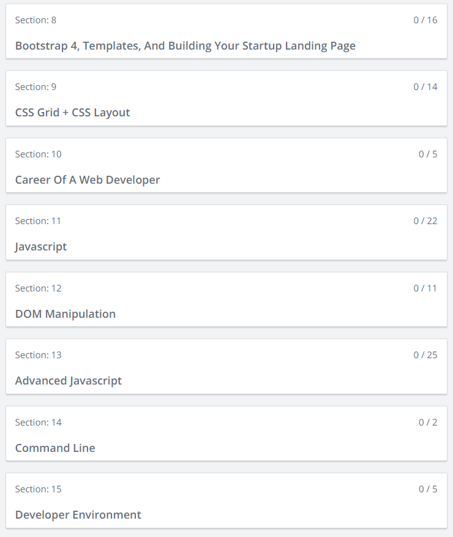
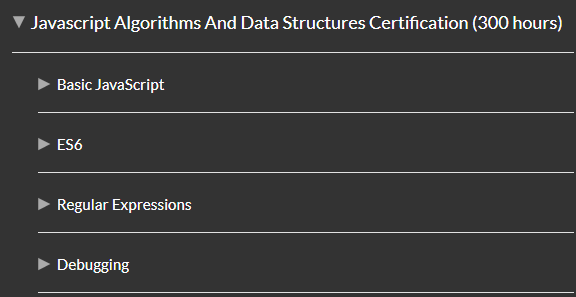

# Daily Log of Round 2 of My 100 Days of Code Journal

  

### Time Frame: 24 February 19 to 3 June 19

## R2Day1: Sunday, 24 Feb

Today starts my second round of the 100 Days of Code Challenge and for this round I'm going to do things a little bit different. First I've decided to create smaller coding goals that I plan to complete each week. On top of having weekly goals, I'm going to do annual code check ins every 30 days so that I can have a better idea of how I'm doing.

### 100 Days of Code Goals

#### Main Goals

My biggest three training goals for this second round is to:
  
  * Conmplete the Responsive Web Design and JavaScript Algorithms and Data Structures Certifications on [freeCodeCamp](https://learn.freecodecamp.org/)
  

  

  * Complete Sections 8 to 15 in the [Zero to Mastery course](https://www.udemy.com/the-complete-web-developer-zero-to-mastery/learn/v4/content)
  

  

  * To actually a project from start to finish in the upcoming [Chingu Voyage](https://chingu.io/)

  

#### Weekly Goals

  * Week 1:
    * Complete all code challenges for the Applied Accessibilitiy and Responsive Web Design Principles sections
    * Complete the Chingu Pre-Work Project and the peer-programming requirments
        

  
  

  * Week 2:
    * Complete all code challenges for the CSS Flexbox and CSS Grid sections
    * Complete Sections 8, 9, and 10 of the Zero to Master course

  
  

  * Week 3:
    * Complete all of the design projects under the Responsive Web Design Projects section
    

  

  * Week 4:
    * Complete annual code check in
    * Complete Sections 11, 12, 13, and 14 of the ZTM course
    

  

  * Week 5, 6, 7, 8:
    * Complete all code challenges for the Basic JavaScript, ES6, Regular Expressions, and Debugging sections
    * Complete annual code check in on Week 8
    

  

  * Week 9:
    * Complete Sections 15, 16, 17, and 18 of the ZTM course
    

  

  * Week 10:
    * Complete all of the code challenges for the Basic Data Structures section
    

  

  * Week 11:
    * Complete all of the code challenges for the Basic Algorithm Scripting section
    

  

  * Week 12:
    * Complete Sections 19, 20, 21 and 22 from the ZTM course
    * Complete annual code check in
    

  

  * Week 13:
    * Complete all of the code challenges for the Object Oriented Programming section
    

  

  * Week 14:
    * Complete all of the code challenges for the Functional Programming section
    * End Round 2 of the 100 Days of Code challenge
    

  

  * Unknown Goal:
    * Hopefully I'll be accepted to the upcoming Chingu Voyage after completeing the pre-course project and pair programming requirements so that I finally complete a team project from start to finish
    
## R2Day2: Monday, 25 Feb

Two days down and I'm off to a great start for my second round of 100 Days of Coding. Yesterday I spent all day writing out all of my goals for this entire round, which I'm hoping it will keep me focused and on the right track. Today I started the Applied Accessibility section and completed half of it, even though I was struggling to stay awake at work. Later when I got home, I started working on my solo project for Chingu and created my README file. 

  

## R2Day3: Tuesday, 26 Feb

Happy to say that I finished the rest of the code challenges for the Applied Accessibility section today. After breezing thru the challenges, I went back to working on the solo project which was a little hard. I had issues trying to add a table in markdown and getting it to render correctly, however, after hours of struggling, I got it to work. Unfortunately, that wasn't the only issue that I ran into tonight. For some reason, I couldn't figure out how to add a video in markdown either.

I'm proud to say that I didn't let this road block get in my way. Instead I spent hours researching my problem on Google and testing various different solutions out before finally stumbling across what I needed to make it work.

  
  

## R2Day4: Wednesday, 27 Feb

  

Due to the fact that all of the pre-course work for the current Chingu Voyage is due in a few days, I deceided to try and knock most of it out today. Unfortunately, things didn't go as smoothly as I would have liked for them to go. While at work I decided to take a look at the [CodeWars](https://www.codewars.com) challenges, but it looked liked I was trying to read Latin so I quickly turned it off. 

After that failed attempt, I decided to wait till I got home to before trying to work on the solo project. The first hour or so of me tackling the project went very smoothly, however, somewhere around the third hour things slowly took a turned for the worst. I was attempting to install Gulp on to my local computer but for some strange reason, I couldn't get it to install correctly. I spent 45 miniutes trying to find a solution to the problem, before I finally realized that I forgot to install it globaly first before trying to add it locally.  

Once I figured out that the problem I thought everything was going to be smooth sailing, boy was I dead wrong.  Apparently, my next roadblock showed up in the form of another error when I tried to add gulp-watch to the project. I was following a code tutorial step-by-step, but for some strange reason I couldn't get it to work. I spent over three hours trying to fix the problem till I just had to give up for the night. However, before I wrapped it up for the night I did send out an SOS on the Chingu Slack channel.

  
  
  

## R2Day5: Thursday, 28 Feb

This morning I woke up feeling very frustrated because of all the errors that I faced last night, that I didn't even bother to try to look back at my code till half the day was gone. However, when I did decide to look back at my code, I was greeted with a very nice surprise. Apparently, someone in the group took pitty on my plight and sent me a solution to my problem. 

  

I was so happy when I saw that solution I almost jumped for joy. Sadly, that feeling didn't last too long because the solution only worked temporarily before I ran into another freaking error. When the new error creeped up, I almost threw my laptop across the room but I quickly thought twice about that since my laptop is practically brand new. Instead I decided to take a break from the solo project and to knock out some of the freeCodeCamp challenges that I had pending for the week.

  

Lucky for me those remaing challenges where short and sweet and it gave me enough time to prepare for my first pair programming session. Which to be honest, a part of me was dreading the session because I was worried that my partner would be far more advanced than me and that they would be very annoyed with being paired with someone of very inferior skills. 
