# Daily Log of Round 3 of My 100 Days of Code Journal

  

### Time Frame: 26 June 2019 to 4 October 2019

## R3Day1: Wednesday - 26 June

Due to the fact that I really didn't accomplish any of my goals from Round 2, I'm going to keep them the same for this round with a few tweaks here and there. 

	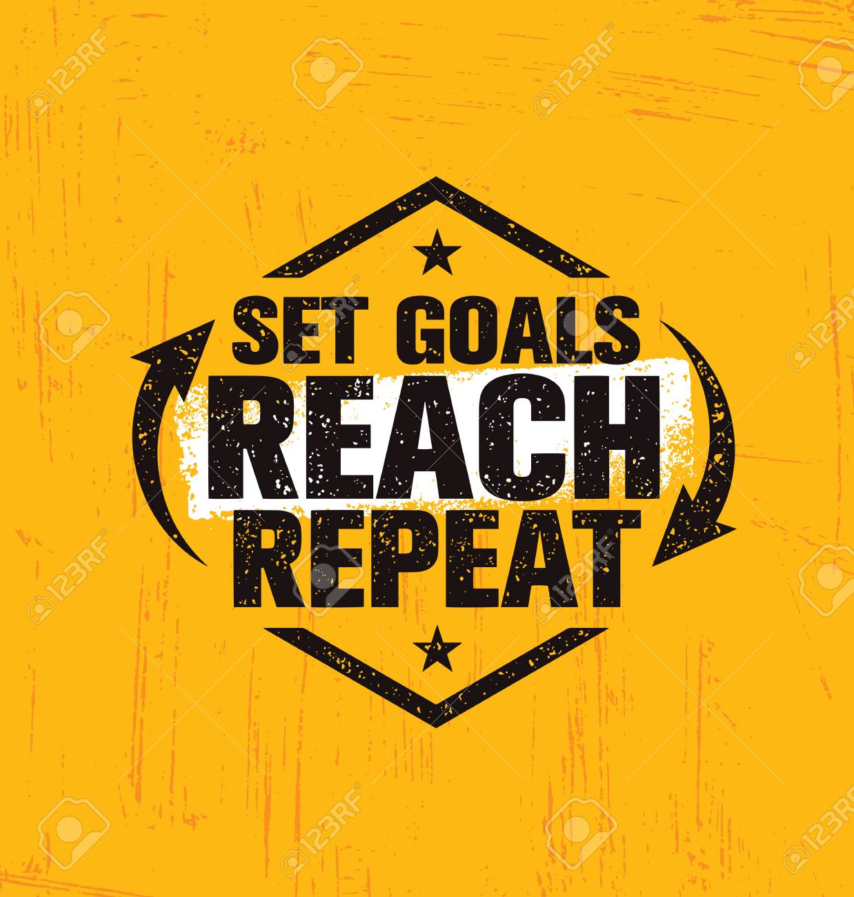

Today starts my third round of the 100 Days of Code Challenge and for this round I'm going to do things a little bit different. First I've decided to create smaller coding goals that I plan to complete each week. On top of having weekly goals, I'm going to do annual code check ins every 30 days so that I can have a better idea of how I'm doing.

### 100 Days of Code Goals

#### Main Goals

My biggest three training goals for this second round is to:
  
  * Conmplete the Responsive Web Design and JavaScript Algorithms and Data Structures Certifications on [freeCodeCamp](https://learn.freecodecamp.org/)
  

  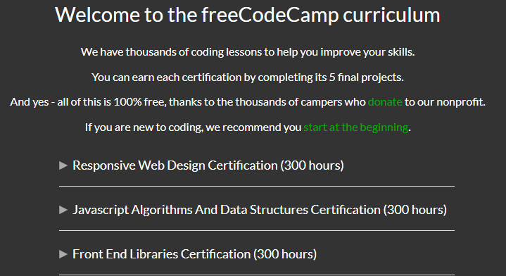

  * Complete Sections 8 to 15 in the [Zero to Mastery course](https://www.udemy.com/the-complete-web-developer-zero-to-mastery/learn/v4/content)
  

  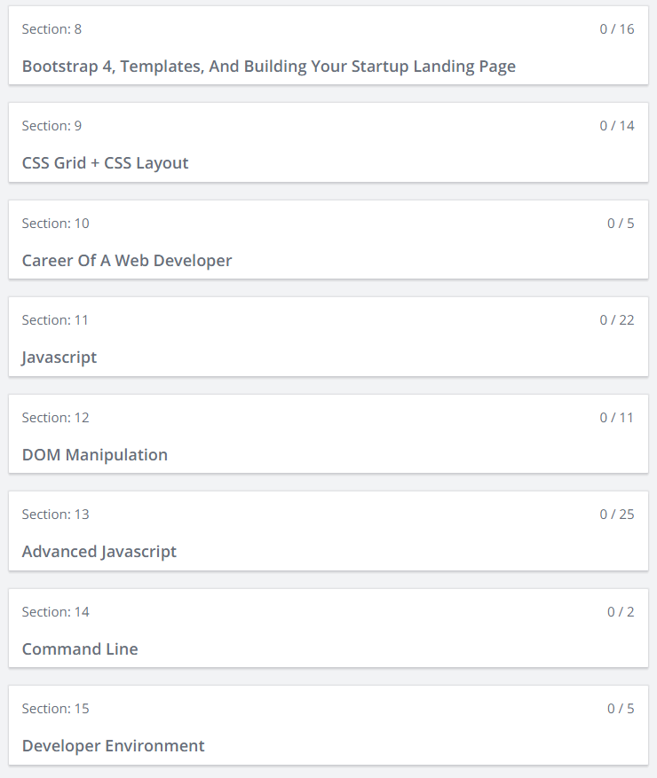

#### Projects:
	
* [Chingu Voyage](https://chingu.io/): I want to take a look back at the previous projects that I've attempted to do and try to complete them.
	
	* [Toucans-Team-4](https://github.com/dreampoetlee/Toucans-Team-4)
	* [Toucans-Team-06](https://github.com/dreampoetlee/Toucans-Team-06)
	* [Chingu-Cohort-8__Solo-Project](https://github.com/dreampoetlee/Chingu-Cohort-8__Solo-Project)
	* [Chingu-Cohort-9__Solo-Project](https://github.com/dreampoetlee/Chingu-Cohort-9__Solo-Project)
	* [Chingu-Cohort-10__Solo-Project](https://github.com/dreampoetlee/Chingu-Cohort-10__Solo-Project)
	

  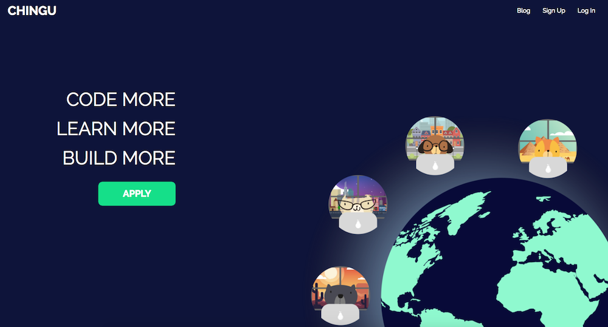

#### Weekly Goals

* Week 1:
	* Complete Sections 1 to 7 of the Zero to Master course

	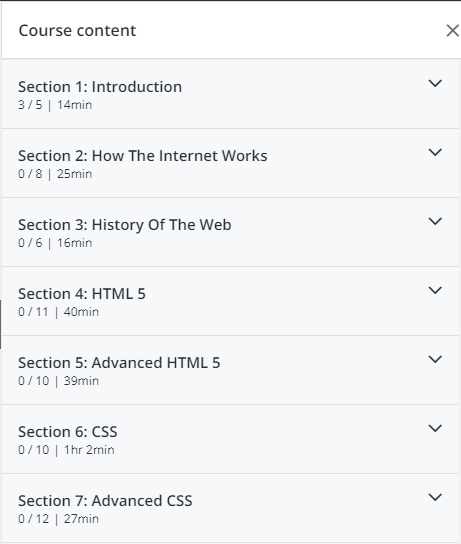

* Week 2:
	* Complete Sections 8, 9, and 10 of the Zero to Master course

	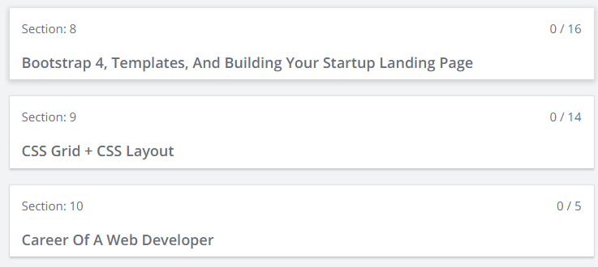

* Week 3:
	* Complete all of the design projects under the Responsive Web Design Projects section
    

  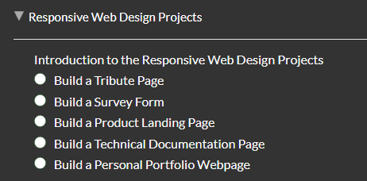

* Week 4:
	* Complete annual code check in
	* Complete Sections 11, 12, 13, and 14 of the ZTM course
    

  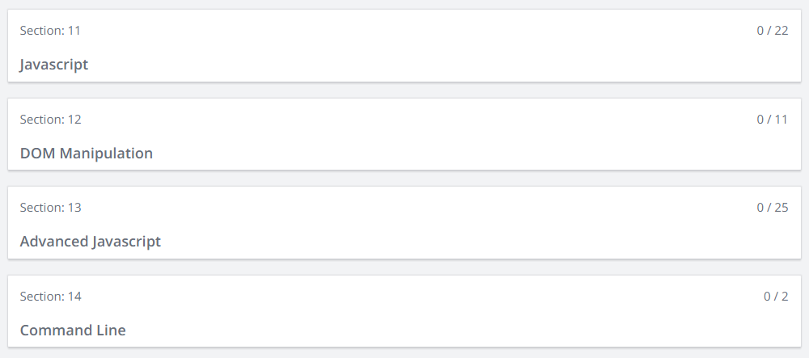

* Week 5, 6, 7, 8:
	* Complete all code challenges for the Basic JavaScript, ES6, Regular Expressions, and Debugging sections
	* Complete annual code check in on Week 8
    

  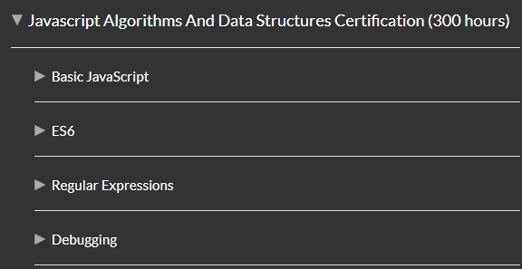

* Week 9:
	* Complete Sections 15, 16, 17, and 18 of the ZTM course
    

  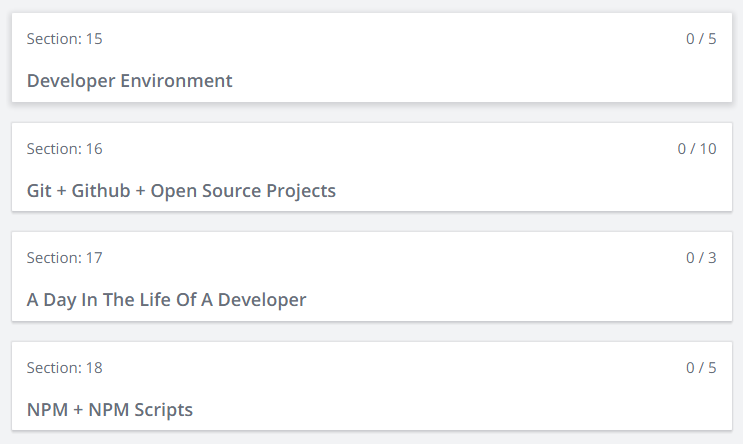

* Week 10:
	* Complete all of the code challenges for the Basic Data Structures section
    

  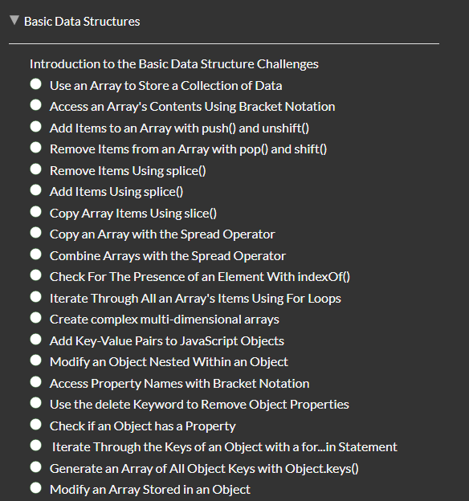

* Week 11:
	* Complete all of the code challenges for the Basic Algorithm Scripting section
    

  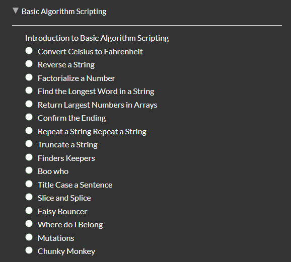

* Week 12:
	* Complete Sections 19, 20, 21 and 22 from the ZTM course
	* Complete annual code check in
    

  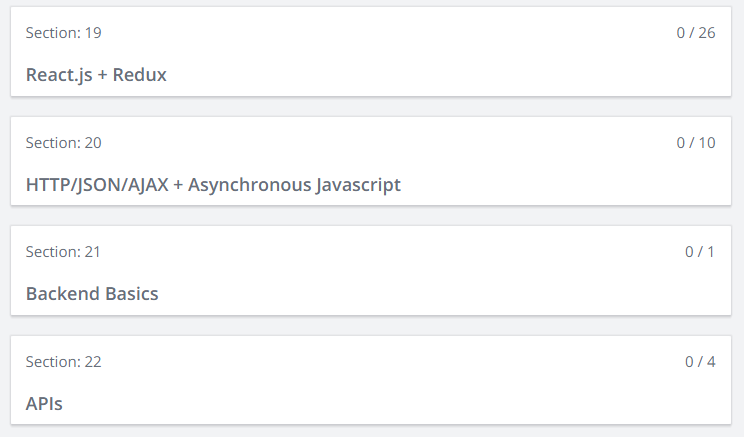

* Week 13:
	* Complete all of the code challenges for the Object Oriented Programming section
    

  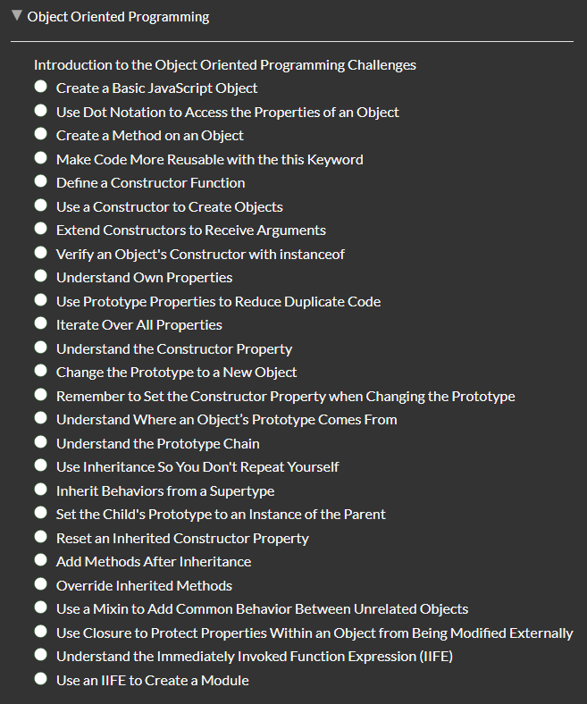

* Week 14:
	* Complete all of the code challenges for the Functional Programming section
	* End Round 3 of the 100 Days of Code challenge
    

  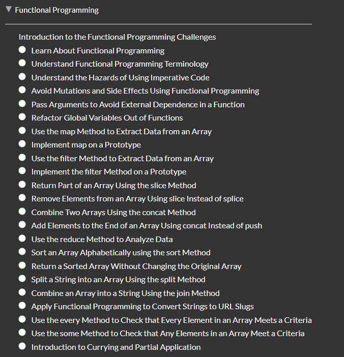

## R3D2: Thursday - 27 Jun

  

So today I decided to the Zero to Master course all over again and reviewed Sections 1 to 4 which basically covered the history of the internet and basic HTML.

  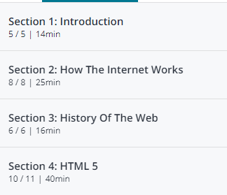

After I finished working on the Zero to Master course, I decided to work on the [sample portfolio website](https://github.com/dreampoetlee/Portfolio-Website-Sample) that I'm building from scratch thanks to the help of Kevin Powell's YouTube series called [Design A Portfolio Website with Adobe XD](https://www.youtube.com/playlist?list=PL4-IK0AVhVjOxfIIsdVlIKfKinHDB0qDR).

  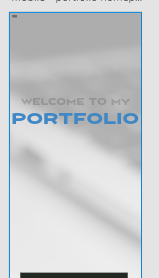

## R3D3: Friday - 28 Jun

  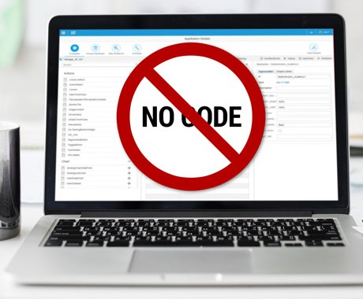

Didn't get a chance to do any coding today due to work being so hectic and I recieved some really interesting news before the day ended. Don't want to say what that news was at this moment till everything becomes official. All I can say right now is that this news will be a big game changer for me and I can't wait.

## R3D4: Saturday - 29 Jun

I have to say, today was a very productive day for me. I spent all morning working on the sample portfolio website that I've been building. My main focus for today was adding the final text to the **Intro** section and including both the **About Me** &amp; **My Work** sections to the website.

  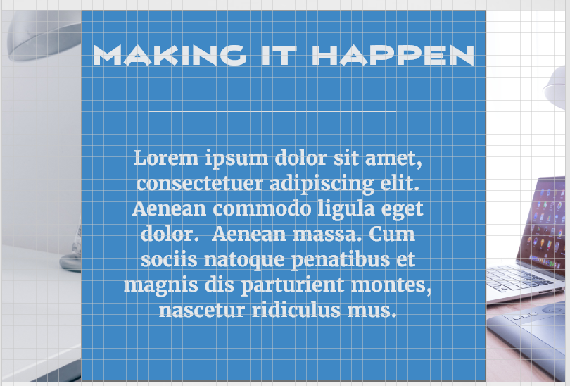
  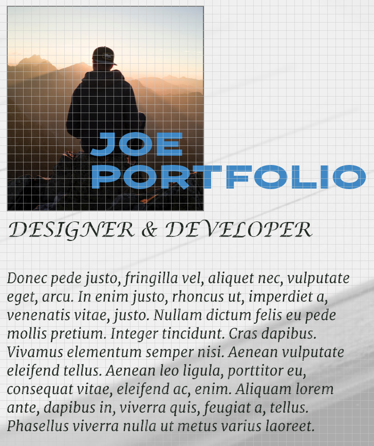
  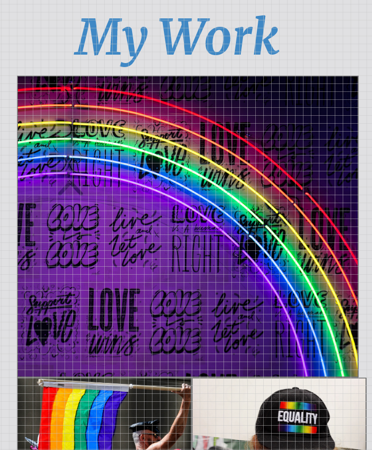

## R3D5: Sunday - 30 June

After watching the new YouTube video [Self Taught vs BootCamp vs College](https://www.youtube.com/watch?v=jAlwZe-UrDY) posted by [Joshua Fluke](https://www.youtube.com/user/Tychos1) where he compared the difference between each options, I decided that even though being a self taught developer

  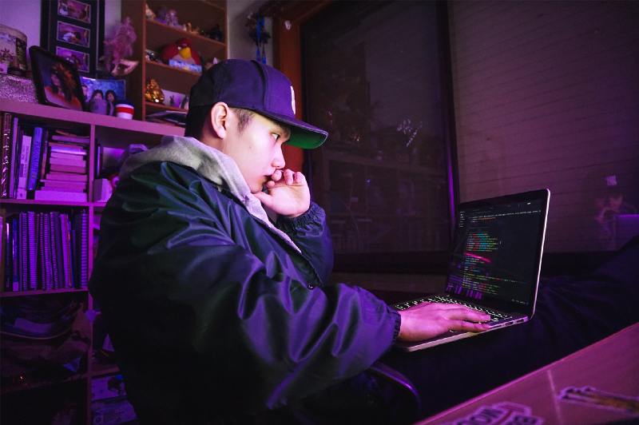

might have been a great idea for me, especially a less costly one. However, it might not have been the overall best option for me considering the fact that it lacks the structure that I so desperately need in order for me to become a Full Stack Developer. So in order to get the structure that I truly feel that I need I'm going to attend Lambda School Coding Bootcamp. However, before I can get in I need to complete the Web Development Precourse work, which I started working on today. The work consists of nine different sections and I was able to complete three of those sections today. I plan to complete the rest of the sections by the end of next week for sure. 

  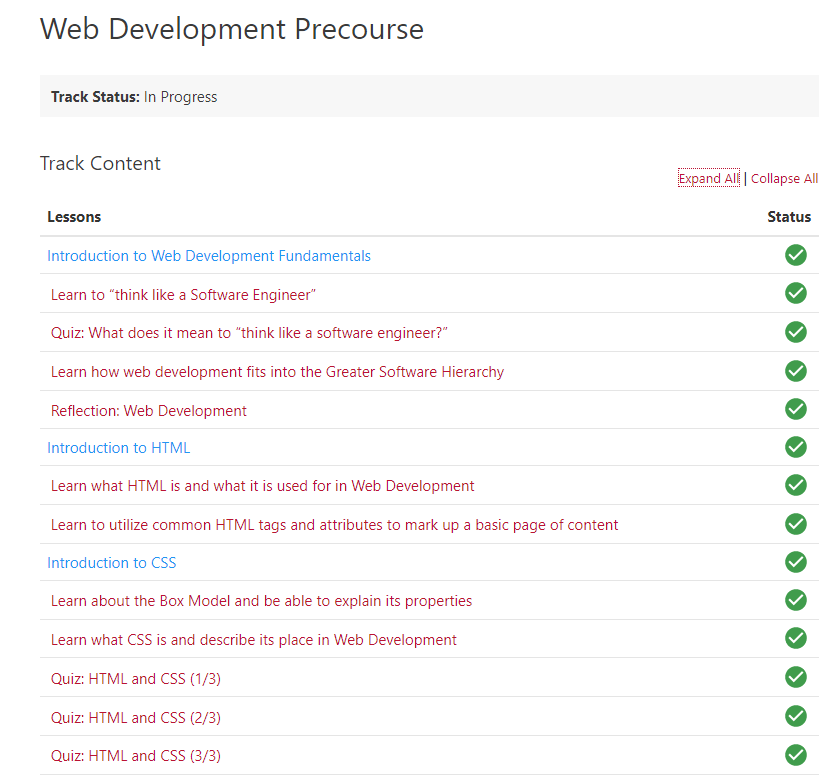

