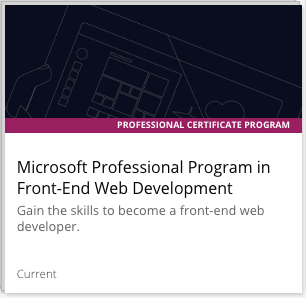
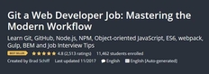
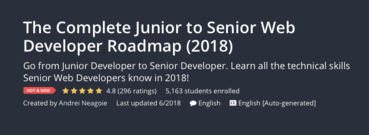

# MY 100_DAYS_OF_CODE EXPERIENCE

A visual journal of my coding journey.

Even though I've been trying to learn to code (on and off) for the past two years. I've decided that I'm going to do the 100 Days of Code Challange and I'm actually going to finish it this time. I may have tried to do this once or twice in the past but for various reasons I never really came close to actually finishing the challenge. However, this time I know that I'm going to finish the challenge this time because I finally took the time to:
* Identify my Goals
* Create a Plan
* Determine the underlining reasons behind me doing the challenge

## My Goals
* **Become a Node Js Developer**
* **Stop Procrasting**
* Complete three courses on https://www.udemy.com
* Earn the Microsoft Professional Program Certificate in Front-End Web Development from https://www.edx.org/microsoft-professional-program-front-end-development: 

* **Stop Procrasting**
* Learn JavaScript
* Get more comfortable with PostCSS
* Learn to write clean code
* **Stop Procrasting**

## My Plan

### Goal: Become a Node Js Developer
### Plan:
### Learning
* Learn the basics of JavaScript
* Learn about web pages and web development technologies like HTML and CSS
* Learn the basics of Node.js
* Be able to write some kind of simple Node.js web application
* Learn about the different frameworks and technologies developers use to develop Node.js applications
### TO-DO:
* Fill in some frameworks or technologies to use with Node.js from research above
* Learn some kind of database technology to use with Node.js
* Learn computer science basics:
  * Algorithms
  * Data structures
* Learn best practices for writing good code.
* Learn how to design the architecture of a Node.js app.
### Preparing for Getting a Job
* Start looking at job descriptions for a Node.js developer in my area and find out what skills employers want
* Come up with a list of companies, locally, that I can likely get a job at
* Start attending user groups in the area
* Start networking with other local Node.js developers
* Hire a resume writer to help me write a good resume
* Practice coding interview questions
* Practice mock interviews
* Build a portfolio of a few apps to demo
### Getting a Job
* Contact all the people in my networks to let them know what value I can provide and what I am looking for
* Start applying for junior-level jobs or internship programs
* Plan to apply for at least two jobs each day
* Debrief with yourself after interview and decide what skills need to be worked on

*Note: I got the plan from John Sonmez book "The Complete Software Developer's Career Guide. His sample plan pretty much sums up my current goals.*

## Training & Video Tutorials
There's so many different training and video tutorials out there all designed to help a person become a better developer that it can be hard to determine which tutorials to use. It doesn't help either that I have the attention span of a

so I get distracted very easily by all the different resources out there. After months of constantly bouncing around from tutorial to tutortial I finally decdided which ones I wanted to use to help me reach my goals.
1. Courses on: 
   * 
   * 
   * 
   
   
   
