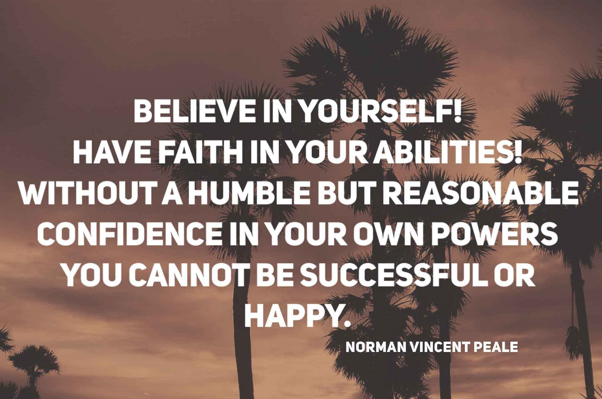
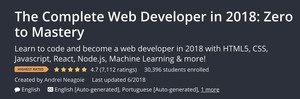

# WELCOME TO THE LAND OF CODZTAPIA

  

## WHERE ALL OF YOUR DREAMS AND DESIRES CAN BECOME A REALITY . . . 

That is if you:

  

I have to admit that when I first attempted to code I really didn't believe in myself or what I was attempting to do. I really felt like a hampster in a cage who kept running and running on that wheel but wasn't getting anywhere fast. Eventually, I got so feed up with not making any headway, I just decided to quite all together and just play video games for the rest of my life. Lucky for me I'm very stubborn, pig headed and it takes a while before I really give up something. I know that if I really apply myself and put in the hardwork I eventually can become a Software Developer and change my life for the better. 

So to help me get where I want to be, I've decided that I'm going to do the 100 Days of Code Challange and I'm actually going to finish it this time. I may have tried to do this once or twice in the past but for various reasons I never really came close to actually finishing the challenge. However, this time I know that I'm going to finish the challenge this time because I finally took the time to:
* Identify my Goals
* Create a Plan
* Determine the underlining reasons behind me doing the challenge

## My Goals
* **Become a Node Js Developer**
* **Stop Procrastinating**
* Complete two to three courses on https://www.udemy.com
* **Stop Procrastinating**
* Learn JavaScript
* Get more comfortable with PostCSS
* Learn to write clean code
* **Stop Procrastinating**

## My Plan

### Goal: Become a Node Js Developer
### Learning Plan:
* Learn the basics of JavaScript
* Learn about web pages and web development technologies like HTML and CSS
* Learn the basics of Node.js
* Be able to write some kind of simple Node.js web application
* Learn about the different frameworks and technologies developers use to develop Node.js applications
### TO-DO:
* Fill in some frameworks or technologies to use with Node.js from research above
* Learn some kind of database technology to use with Node.js
* Learn computer science basics:
  * Algorithms
  * Data structures
* Learn best practices for writing good code.
* Learn how to design the architecture of a Node.js app.
### Preparing for Getting a Job
* Start looking at job descriptions for a Node.js developer in my area and find out what skills employers want
* Come up with a list of companies, locally, that I can likely get a job at
* Start attending user groups in the area
* Start networking with other local Node.js developers
* Hire a resume writer to help me write a good resume
* Practice coding interview questions
* Practice mock interviews
* Build a portfolio of a few apps to demo
### Getting a Job
* Contact all the people in my networks to let them know what value I can provide and what I am looking for
* Start applying for junior-level jobs or internship programs
* Plan to apply for at least two jobs each day
* Debrief with yourself after interview and decide what skills need to be worked on

*Note: I got the plan from John Sonmez book "The Complete Software Developer's Career Guide. His sample plan pretty much sums up my current goals.*

## Massive Open Online Cources (MOOCs)
There's so many different training and video tutorials out there all designed to help a person become a better developer that it can be hard to determine which tutorials to use. It doesn't help either that I have the attention span of a

So I get distracted very easily by all the different resources out there. After months of constantly bouncing around from tutorial to tutortial I finally decdided which ones I wanted to use to help me reach my goals.

At the same time, I'm going to apply to the Lambda School Full-Stack Web & Computer Science BootCamp course. I'm hoping that I get in so that I can add another sense of structure to my learning program. In addition, I going to take part in the 30 Days, 30 Website Challenge!!!

I know it sounds like a lot of stuff to accomplish in 100 days but I'm so ready to get started and to change my life for the better!!!

# START DATE: 1 NOV 18!!!!!

# Additional Rules
  * I will tweet about my progress every day -> using the hashtag #100DaysofCode on all of my social media accounts.
  * I will push code to GitHub every day so that anyone can see my progress.
  * I will update the (Log)[log.md] with the day's progress and provide a link so that others see my progress.
  
# Logs
[Round 1](R1.md)
   

   
   
   
