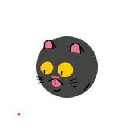

# MY 100 DAYS OF CODE JOURNAL

A visual journal of my coding journey.

Even though I've been trying to learn to code (on and off) for the past two years. I've decided that I'm going to do the 100 Days of Code Challange and I'm actually going to finish it this time. I may have tried to do this once or twice in the past but for various reasons I never really came close to actually finishing the challenge. However, this time I know that I'm going to finish the challenge this time because I finally took the time to:
* Identify my Goals
* Create a Plan
* Determine the underlining reasons behind me doing the challenge

## My Goals
* **Become a Node Js Developer**
* **Stop Procrastinating**
* Complete two to three courses on https://www.udemy.com
* **Stop Procrastinating**
* Learn JavaScript
* Get more comfortable with PostCSS
* Learn to write clean code
* **Stop Procrastinating**

## Massive Open Online Cources (MOOCs)
There's so many different training and video tutorials out there all designed to help a person become a better developer that it can be hard to determine which tutorials to use. It doesn't help either that I have the attention span of a

So I get distracted very easily by all the different resources out there. After months of constantly bouncing around from tutorial to tutortial I finally decdided which ones I wanted to use to help me reach my goals.
* 
* 

At the same time, I'm going to apply to apply to Lambda School Full-Stack Web & Computer Science BootCamp course. I'm hoping that I get in so that I can add another sense of structure to my learning program. In addition, I going to take part in the 30 Days, 30 Website Challenge!!!

I know it sounds like a lot of stuff to accomplish in 100 days but I'm so ready to get started and to change my life for the better!!!

# START DATE: 1 NOV 18!!!!!

# Additional Rules
  * I will tweet about my progress every day -> using the hashtag #100DaysofCode.
  * I will push code to GitHub every day so that anyone can see my progress.
   

   
   
   
