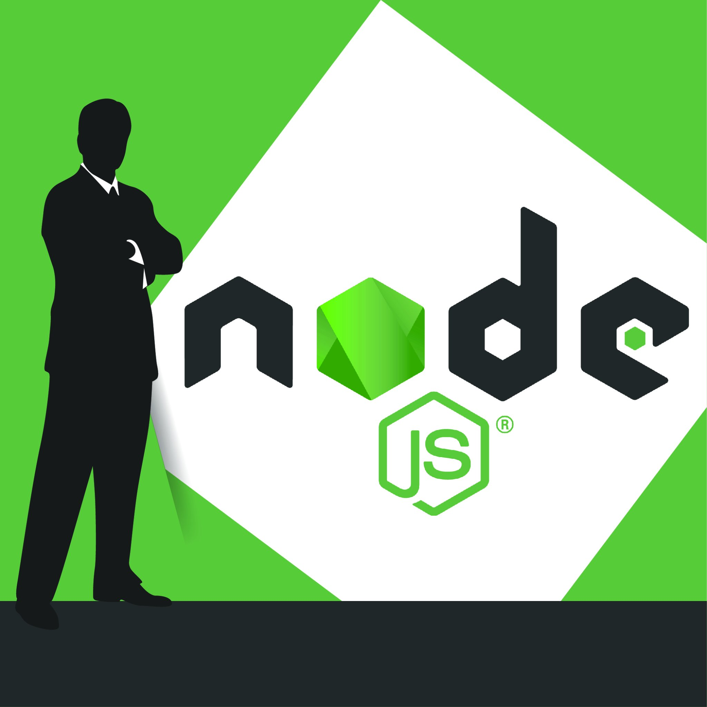

## My Plan

### Goal: Become a Node Js Developer

  

### Learning Plan:

* Learn the basics of JavaScript
* Learn about web pages and web development technologies like HTML and CSS
* Learn the basics of Node.js
* Be able to write some kind of simple Node.js web application
* Learn about the different frameworks and technologies developers use to develop Node.js applications

### TO-DO:

* Fill in some frameworks or technologies to use with Node.js from research above
* Learn some kind of database technology to use with Node.js
* Learn computer science basics:
  * Algorithms
  * Data structures
* Learn best practices for writing good code.
* Learn how to design the architecture of a Node.js app.

### Preparing for Getting a Job

* Start looking at job descriptions for a Node.js developer in my area and find out what skills employers want
* Come up with a list of companies, locally, that I can likely get a job at
* Start attending user groups in the area
* Start networking with other local Node.js developers
* Hire a resume writer to help me write a good resume
* Practice coding interview questions
* Practice mock interviews
* Build a portfolio of a few apps to demo

### Getting a Job

* Contact all the people in my networks to let them know what value I can provide and what I am looking for
* Start applying for junior-level jobs or internship programs
* Plan to apply for at least two jobs each day
* Debrief with yourself after interview and decide what skills need to be worked on
*Note: I got the plan from John Sonmez book "The Complete Software Developer's Career Guide. His sample plan pretty much sums up my current goals.*

## Massive Open Online Cources (MOOCs)

There's so many different training and video tutorials out there all designed to help a person become a better developer that it can be hard to determine which tutorials to use. It doesn't help either that I have the attention span of a

So I get distracted very easily by all the different resources out there. After months of constantly bouncing around from tutorial to tutortial I finally decdided which ones I wanted to use to help me reach my goals.

At the same time, I'm going to apply to the Lambda School Full-Stack Web & Computer Science BootCamp course. I'm hoping that I get in so that I can add another sense of structure to my learning program. In addition, I going to take part in the 30 Days, 30 Website Challenge!!!

I know it sounds like a lot of stuff to accomplish in 100 days but I'm so ready to get started and to change my life for the better!!!